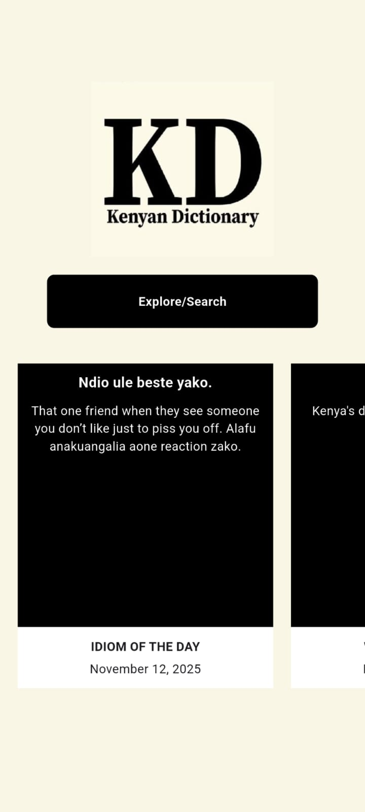
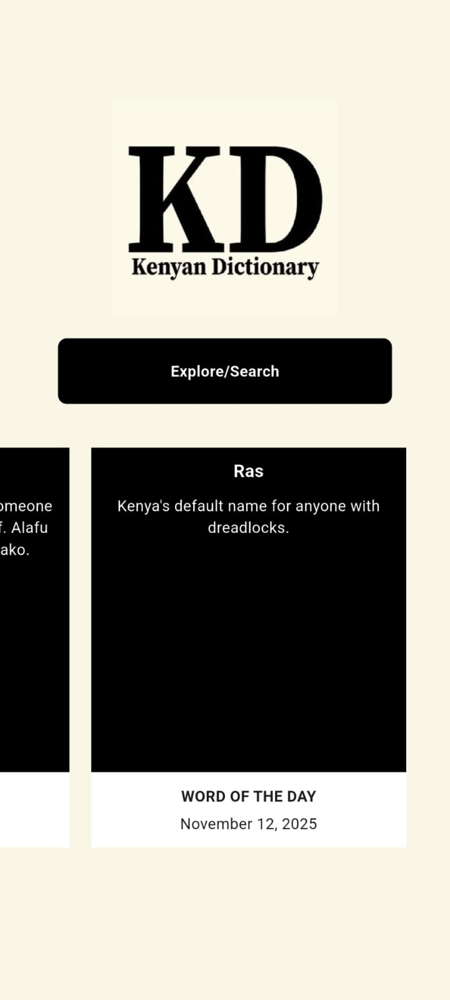
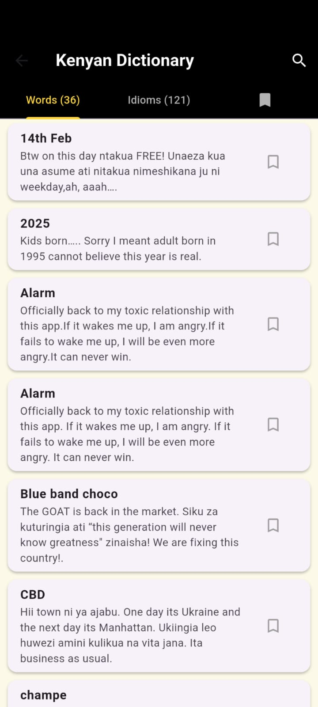
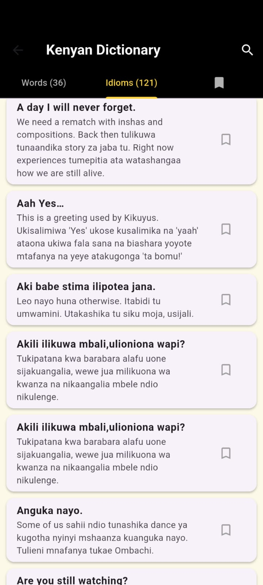
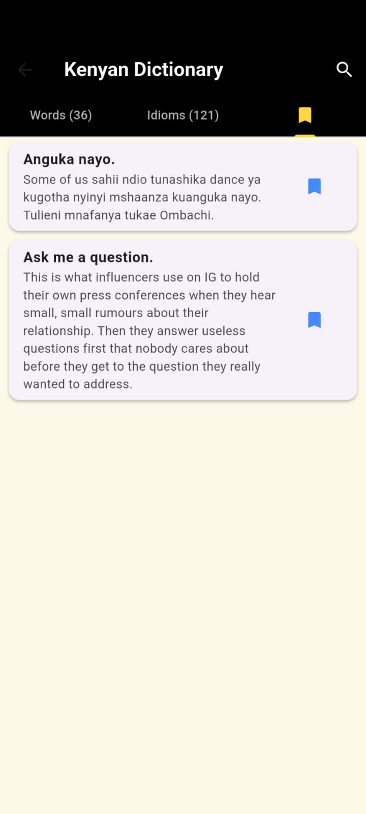
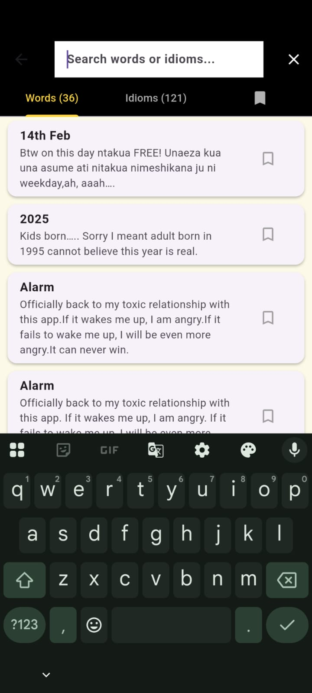

---

# 🇰🇪 Kenyan Dictionary App

[](https://kenyandictionaryapp-7ef26.web.app/)
[](https://drive.google.com/file/d/11CCCVQ_3rRnM3pLHzHy5e7P_7Z0LvpAr/view?usp=sharing)
[](https://github.com/antonymwakiacha/kenyandictionaryapp/raw/main/apk/KenyanDictionaryApp.apk)
[](https://flutter.dev)
[](https://supabase.com)
[](https://www.djangoproject.com/)
[](https://railway.app/)
[](LICENSE)

---

## 🎬 Access the App

* **Web App:** [Open in Browser](https://kenyandictionaryapp-7ef26.web.app/)
* **View the app demo:** [Watch Demo](https://drive.google.com/file/d/11CCCVQ_3rRnM3pLHzHy5e7P_7Z0LvpAr/view?usp=sharing)
* **Download the APK:** [Get APK](https://github.com/antonymwakiacha/kenyandictionaryapp/raw/main/apk/KenyanDictionaryApp.apk)

---

## 🖼️ App Screenshots Gallery

### Landing & Home Screens

| Landing Screen                            | Home Screen 1                           | Home Screen 2                           |
| ----------------------------------------- | --------------------------------------- | --------------------------------------- |
|  |  |  |

### Explore, Idiom & Bookmarks Screens

| Explore Screen                             | Idiom Screen                           | Bookmarks Screen                               |
| ------------------------------------------ | -------------------------------------- | ---------------------------------------------- |
|  |  |  |

### Search & Example Results Screens

| Search Bar                                  | Example Results                                   |
| ------------------------------------------- | ------------------------------------------------- |
|  |  |

**Captions / Flow Overview:**

* **Landing & Home Screens:** Entry point and main browsing interface
* **Explore, Idiom & Bookmarks Screens:** Navigating content and saving favorites
* **Search & Example Results Screens:** Searching and viewing idioms

---

## 🌟 Features

[](https://github.com/antonymwakiacha/kenyandictionaryapp)
[](https://github.com/antonymwakiacha/kenyandictionaryapp)
[](https://github.com/antonymwakiacha/kenyandictionaryapp)

* 🔤 Explore Kenyan idioms and their meanings
* 🔍 Smart search functionality
* 💾 Supabase database integration
* ⚡ Real-time updates through API
* 🧱 Modular Flutter architecture
* 🎨 Clean and responsive user interface

---

## 🧰 Tech Stack

| Technology      | Purpose                               |
| --------------- | ------------------------------------- |
| 🐦 **Flutter**  | Frontend development                  |
| 💙 **Dart**     | Core programming language             |
| 🔮 **Supabase** | Database & backend services           |
| 🧩 **Django**   | API proxy backend                     |
| 🌐 **REST API** | Communication between app and backend |
| 🛤️ **Railway** | Hosting the Django proxy              |
| 🧾 **GitHub**   | Version control & documentation       |

---

## ⚙️ Architecture Overview

```
Flutter App 
   ↓
Django Backend Proxy (API Layer, deployed on Railway)
   ↓
Supabase Database (Idioms & Words Tables)
```

Repository: [supabase_proxy_backend](https://github.com/antonymwakiacha/supabase_proxy_backend)

---

## 🗄️ Database Schema

### **Table: `idioms`**

```sql
create table public.idioms (
  id bigint generated always as identity not null,
  phrase text not null,
  meaning text not null,
  is_bookmarked boolean null default false,
  created_at timestamp with time zone null default now(),
  constraint idioms_pkey primary key (id)
) TABLESPACE pg_default;
```

### **Table: `words`**

```sql
create table public.words (
  id bigint generated always as identity not null,
  name text not null,
  type text null,
  meaning text not null,
  is_bookmarked boolean null default false,
  created_at timestamp with time zone null default now(),
  constraint words_pkey primary key (id)
) TABLESPACE pg_default;
```

---

## 💻 Installation & Run Locally (Flutter)

1️⃣ **Clone the repository**

```bash
git clone https://github.com/antonymwakiacha/kenyandictionaryapp.git
cd kenyandictionaryapp
```

2️⃣ **Install dependencies**

```bash
flutter pub get
```

3️⃣ **Configure API endpoint**
In `lib/services/api_service.dart`, set the backend base URL to your Django proxy on Railway:

```dart
const String baseUrl = "https://your-django-backend-domain/api";
```

4️⃣ **Run the app on your device/emulator**

```bash
flutter run
```

> ✅ Ensure Flutter SDK is installed and a device/emulator is configured

---

## 🚀 Future Improvements

* User authentication and profiles
* Cloud syncing of bookmarks
* Admin dashboard for adding/editing content
* Support for regional dialects and translations

---

## ⚠️ Disclaimer

> ⚖️ **Content Ownership Notice**
> The idioms and words featured in this app belong to the original creators of **Kenyan Dictionary**, from their official [Instagram page](https://www.instagram.com/kenyan_dictionary/).
>
> 📝 I do **not own** the content. All credit goes to the original authors.
> This app is created **strictly for educational and portfolio purposes**, with **no intent to monetize or infringe** on intellectual property rights.

If you are the content owner and wish to request modification, attribution, or removal, please contact me directly.

---

## 👨‍💻 Author

**Antony Wugoma**
📍 Mombasa, Kenya
📧 [tonywugoma@gmail.com](mailto:tonywugoma@gmail.com)
🔗 [LinkedIn](https://www.linkedin.com/in/antony-wugoma-a22797157/)

---

## 🪪 License

This project is licensed under the [MIT License](LICENSE).
You’re free to use and modify the **codebase** for learning or personal projects — but the **content** remains the property of its original creators.

---


